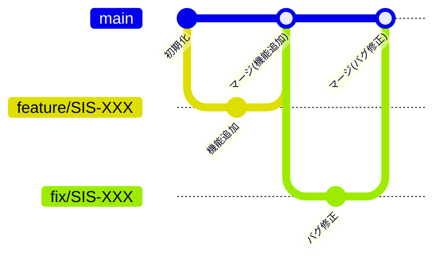

# helpdesk-app-frontend

## プロジェクト / アプリ概要

このプロジェクトは、社内向けヘルプデスクアプリのフロントエンドです。

社員が業務上の困りごとや質問をチャット形式で投稿すると、サポーターが回答を返す仕組みを提供します。

【社員】  
ログイン後、チャット画面からサポーターに質問を投げることができます。  
自分の質問に対する回答を確認できるだけでなく、他の社員の質問も履歴として残るため参照することが可能です。  
各質問には、ステータス（例：新規質問、対応中、解決済みなど） が設定され、対応状況を確認することができます。

【サポーター】  
社員から寄せられた質問を確認し、適切な回答をチャットで返します。  
また、全ての質問・回答の履歴を確認でき、対応状況の把握や品質管理に役立てられます。  
各質問には、ステータス（例：新規質問、対応中、解決済みなど） が設定され、対応状況を確認することができます。

【管理者】  
社員やサポーターのユーザー管理（追加・削除）を行うことができます。  
また、全ての質問・回答の履歴を確認でき、対応状況の把握や品質管理に役立てられます。

すべてのユーザー（社員／サポーター／管理者）は、ログイン画面から認証を行い、  
それぞれの専用ページにアクセスして機能を利用します。

---

## 使用技術

- 言語: TypeScript
- フレームワーク: React
- ビルドツール: Vite
- UIライブラリ: Chakra UI
- パッケージ管理: Yarn

---

## ディレクトリ構成（src/以下）

- components/：UIコンポーネント群
- core/：アプリ全体の設定・初期化
- feature/：機能単位の実装置き場（hooks/components/handlers/queries/mutationsを集約）
- models/：型定義・スキーマの集約
- routes/：画面ルーティング定義
- services/：バックエンドAPI呼び出し
- shared/：横断的な共通資産
  - logic/:軽微な関数（外部APIは叩かない && tsファィルのみ許容）
- tests/：テスト共通セットアップ・モック・設定

---

## 前提条件

- Node.js 24.x 以上を推奨

  Node.js のバージョン確認

  ```bash
  node -v
  ```

  出力例

  ```bash
  v24.2.0
  ```

- Yarn（パッケージマネージャ）がインストールされていること

  Yarn のインストール状況を確認

  ```bash
  yarn -v
  ```

  出力例

  ```bash
  1.22.22
  ```

  Yarn が未インストールの場合、以下のコマンドでグローバルインストール

  ```bash
  npm install -g yarn
  ```

  > このコマンドは、Node.js 付属の npm を使用して、Yarn をグローバル環境（どのプロジェクトでも使える状態）にインストールします。
  > 以降、プロジェクトごとの依存管理やスクリプト実行を Yarn で行うことができます。

---

## 環境構築手順

1. リポジトリをクローン

```bash
  git clone git@github.com:novel-sarugaku/helpdesk-app-frontend.git
  cd helpdesk-app-frontend
```

> 上記は SSH を使用した場合の例 です。  
> HTTPS を使用する場合は GitHub 上でリポジトリのクローン用 URL を変更してください。2. 依存パッケージをインストール

```bash
yarn install
```

> 初回実行時、yarn.lockおよび node_modulesフォルダが自動生成されます。3. 開発サーバーを起動

```bash
yarn dev
```

4. ブラウザでアクセス  
   http://localhost:5173

---

## ブランチ運用について

### 概要

本プロジェクトでは、開発効率の向上とコード品質の維持を目的に、GitHub上でのブランチ運用ルールを定める。ブランチ戦略を明文化し、コードレビューやリリース手順を標準化することで、品質を保ちながら作業の重複やコンフリクトを最小化する。チーム全員が合意したルールに従うことで、スムーズなコラボレーションと安定したリリースサイクルを実現する。

---

### ブランチ構成

#### main

- 目的： 本番環境の状態を管理
- 特徴： 常に安定した状態を保つ
- 使用タイミング： リリース確定時

#### feature/\*

- 目的： 新機能開発用ブランチ
- 特徴： 1タスク1ブランチ
- 分岐元 / マージ先： mainブランチ
- 使用タイミング： 機能実装時

#### fix/\*

- 目的： バグ修正用ブランチ
- 特徴： 原因箇所への最小修正を原則とする
- 分岐元 / マージ先： mainブランチ
- 使用タイミング： PRのマージ後にバグがあった場合

---

### ブランチ命名規則

#### feature/\* の場合

```bash
書き方：feature/タスク番号
例：feature/SIS-1
```

#### fix/\* の場合

```bash
書き方：fix/タスク番号
例：fix/SIS-1
```

> ※タスク番号：IRAのストーリー/バグキーのこと

---

### 使用時のルール

#### 運用フロー図



---

#### 開発フロー

**1. main ブランチからタスク毎に featureまたはfix ブランチを作成**

- 各担当者が開発・修正作業
- 作業後、リモートリポジトリへPush

**2. Pull Request（以降PRとする）を作成**

- 書き方
  - タイトル
    - 必ずタイトル頭に[タスク番号]を記載
    - 例： [SIS-1] xxxxxxxx
      > ※タスク番号：JIRAのストーリー/バグキーのこと
  - 内容
    - 以下の内容を記述
      - 概要
      - 変更点
      - 影響範囲
      - テスト
      - 該当タスク
- レビュアー設定
  - 事前に Collaborators で追加したメンバーの中から指定
- 統合先の確認
  - 統合先が main ブランチになっているかを確認
- 原則
  - CIによるチェックをクリアすること
  - 他者レビューを必ず経由すること

**3. コードレビュー**

- 管理者がソースレビューを実施
- 承認後にマージ

---

### タスクに対するブランチの使用方法

- JIRAで自分が担当のタスクを確認
  > ※タスク：JIRAのストーリーのこと
- main ブランチから、各タスクに対して1ブランチを作成
- 作業完了後、PRを提出
- PR承認後、main ブランチにマージ

---

### 禁止事項

- main ブランチに直接 push しない
- 未レビューのコードを merge しない
- 命名規則に従わないブランチ作成

---

### 例外

今回のプロジェクトでは、 developやrelease ブランチは使用せず、feature/_ や fix/_ などの作業ブランチから main ブランチへ直接マージする方針とする。

---

## Linter / Formatter - ESLint / Prettier

このプロジェクトでは JavaScript / TypeScript のコード整形および静的解析ツールとして ESLint と Prettier を使用しています。

---

### 使用目的

#### ESLint

- 構文エラーやバグの検出
- 型の不整合や未使用変数の検出
- React Hooks のルール違反チェック
- チームで統一されたコードスタイルの維持

#### Prettier

- 自動コード整形
- セミコロン、インデント、クォートなどのスタイル統一
- 保存時のフォーマット対応

### CLI での実行方法

```bash
# ESLint によるコードチェック
yarn lint

# ESLint による自動修正を含むチェック
yarn lint:fix

# Prettier によるフォーマットチェック
yarn format

# Prettier による自動整形
yarn format:fix
```
